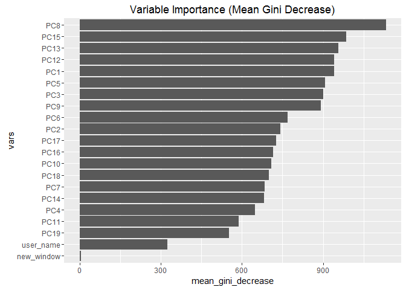

# Course Project
Miles  
February 24, 2016  

##Executive Summary

Below an effort is made to create a prediction model based on movement tracking data in collected while subjects performed a dumbell curl. The goal is to accurately predict the classe variable which defines the correctness of the overall movement (coded A:E). 
<br>
<br>
Cleaning the data and turning the original set into a lower dimensional set proved to be the key in creating an accurate model. A random forest model was ultimately used and resulted in a very low OOB error and high accuracy on the test set.
<br>
<br>
<br>

##Data Loading and Processing


Initially looking at these datasets, there appears to be three major problems

* The data is high dimensional
* There are several variables that contain NA values for over half the observations. 
* Some variables appear to be irrelevant (i.e variable 'X', 'tiimestamp')

Creating an accurate model will neccessitate dealing with these data issues.


```r
training <- read.csv("https://d396qusza40orc.cloudfront.net/predmachlearn/pml-training.csv")

testing <- read.csv("https://d396qusza40orc.cloudfront.net/predmachlearn/pml-testing.csv")

dim(training) #dimensions of the training set
```

```
## [1] 19622   160
```

```r
training.na <- which((colSums(is.na(training))>19622/2)==TRUE)#which columns are composed of primairly NA values
length(training.na) #count of the NA columns
```

```
## [1] 67
```

```r
dim(testing)#dimensions of the testing set
```

```
## [1]  20 160
```

```r
testing.na <- which((colSums(is.na(testing))>20/2)==TRUE)#which columns are composed or primarily NA values
length(testing.na)#count of the NA columns
```

```
## [1] 100
```

```r
training.na %in% testing.na #the NA columns between the datasets appear to match
```

```
##  [1] TRUE TRUE TRUE TRUE TRUE TRUE TRUE TRUE TRUE TRUE TRUE TRUE TRUE TRUE
## [15] TRUE TRUE TRUE TRUE TRUE TRUE TRUE TRUE TRUE TRUE TRUE TRUE TRUE TRUE
## [29] TRUE TRUE TRUE TRUE TRUE TRUE TRUE TRUE TRUE TRUE TRUE TRUE TRUE TRUE
## [43] TRUE TRUE TRUE TRUE TRUE TRUE TRUE TRUE TRUE TRUE TRUE TRUE TRUE TRUE
## [57] TRUE TRUE TRUE TRUE TRUE TRUE TRUE TRUE TRUE TRUE TRUE
```

```r
names(training) %in% names(testing) #the columns in general do match, aside from the 'classe' variable and the 'problem_id' variable which only appear in the training and testing sets repsectively.
```

```
##   [1]  TRUE  TRUE  TRUE  TRUE  TRUE  TRUE  TRUE  TRUE  TRUE  TRUE  TRUE
##  [12]  TRUE  TRUE  TRUE  TRUE  TRUE  TRUE  TRUE  TRUE  TRUE  TRUE  TRUE
##  [23]  TRUE  TRUE  TRUE  TRUE  TRUE  TRUE  TRUE  TRUE  TRUE  TRUE  TRUE
##  [34]  TRUE  TRUE  TRUE  TRUE  TRUE  TRUE  TRUE  TRUE  TRUE  TRUE  TRUE
##  [45]  TRUE  TRUE  TRUE  TRUE  TRUE  TRUE  TRUE  TRUE  TRUE  TRUE  TRUE
##  [56]  TRUE  TRUE  TRUE  TRUE  TRUE  TRUE  TRUE  TRUE  TRUE  TRUE  TRUE
##  [67]  TRUE  TRUE  TRUE  TRUE  TRUE  TRUE  TRUE  TRUE  TRUE  TRUE  TRUE
##  [78]  TRUE  TRUE  TRUE  TRUE  TRUE  TRUE  TRUE  TRUE  TRUE  TRUE  TRUE
##  [89]  TRUE  TRUE  TRUE  TRUE  TRUE  TRUE  TRUE  TRUE  TRUE  TRUE  TRUE
## [100]  TRUE  TRUE  TRUE  TRUE  TRUE  TRUE  TRUE  TRUE  TRUE  TRUE  TRUE
## [111]  TRUE  TRUE  TRUE  TRUE  TRUE  TRUE  TRUE  TRUE  TRUE  TRUE  TRUE
## [122]  TRUE  TRUE  TRUE  TRUE  TRUE  TRUE  TRUE  TRUE  TRUE  TRUE  TRUE
## [133]  TRUE  TRUE  TRUE  TRUE  TRUE  TRUE  TRUE  TRUE  TRUE  TRUE  TRUE
## [144]  TRUE  TRUE  TRUE  TRUE  TRUE  TRUE  TRUE  TRUE  TRUE  TRUE  TRUE
## [155]  TRUE  TRUE  TRUE  TRUE  TRUE FALSE
```
<br>
<br>

###Cleaning the Data
Looking through the variables, the first step of cleaning this data includes getting rid of the variables that contain primarily NA data. Including this data could lead to overfitting and skew the fitted model. It may be possible to impute the NA values, however there seems to be too many NA values for this to be a good idea. Some of the NA values are the result that  the non-NA vaules are recording max/mins/means. These could perhaps be used in place of the numerous observations, but with such a high dimensional dataset it is better to use as many observations as possible.
<br>
<br>
Secondly, there are several variables that one can infer are not likely to be related or result in good prediction. The 'problem_id' and 'X' variables are just the index numbers and are also likely to skew prediction if included. The time stamp also is not likely to be related to the classe of the movement.
<br>
<br>
Lastly, the testing set does not contain all the variables included in the training set. It does not make sense to retain the variables that do not exist between both sets, because it will not be possible to use them for prediction.


```r
library(dplyr); library(magrittr)
```

```
## 
## Attaching package: 'dplyr'
```

```
## The following objects are masked from 'package:stats':
## 
##     filter, lag
```

```
## The following objects are masked from 'package:base':
## 
##     intersect, setdiff, setequal, union
```

```r
testing2 <- testing[, colSums(is.na(testing)) < 1] %>% select(-contains("time"), -X, -problem_id) #selects only the variables that are full of NA values

matchcols <- na.omit(match(colnames(testing2), colnames(training))) #creates a variable that contains the matching column positons


training2<- select(training, matchcols) # selects only variables that were in the test set 

dim(training2)
```

```
## [1] 19622    55
```

```r
dim(testing2)
```

```
## [1] 20 55
```
<br>
<br>

###Dimension Reduction
Removing the extraneous variables reduced the dimensions of the data quite extensively, however many of the remaining variables are probably highly correlated. Below a principal component analysis is conducted on the training set. A threshold of explaining 90% of the variabeles is imposed on the function. The resulting dataset has only 21 predictor variables, compared to the 55 variables in the cleaned dataset above. This is a much more reasonable dataset to use in prediction.


```r
library(caret)
```

```
## Loading required package: lattice
```

```
## Loading required package: ggplot2
```

```r
set.seed(1917)


preProc <- preProcess(training2, method = "pca", thresh = .90) #the PCA model is fit on the training data with the threshold of explaining 90% of the variance in the data
 

preProc.training <- predict(preProc, training2) %>% mutate(classe = training$classe) #the PCA model is ran on the training set to get the PCA values

dim(preProc.training) #note the classe variable was reattached above, so the predictors were reduced from 55 to 21
```

```
## [1] 19622    22
```

<br>
<br>
<br>

##Fitting a Model


A random forest is fit using the ranger package (provides a much faster implemenation of the random forest algorithim) resulting in a classification tree model. Default settings were used, aside from assigning the model to record the Gini Impurity Index, and 500 trees were grown.
<br>
<br>
No cross validation is necessary with the random forest algorithim since it bootstraps the sample for each tree grown (as explained here http://www.stat.berkeley.edu/~breiman/RandomForests/cc_home.htm#ooberr). After the bootstrap, a subset is left out from each of the samples and consequently in each of the tree's construction (about 1/3 of the observations are left out). For each instance where the observation is left out, it is ran through the tree as a out of bag test set. The average (or in this case the majority-vote as the goal is classification) response is taken as the out of bag prediction. These predictions are then measured up against the true value. The result is represented by the out of bag error show below.


```r
library(ranger)
set.seed(1311)

fit.rf <- ranger(classe~., data = preProc.training, write.forest = TRUE, importance = "impurity") #ranger is a fast implementation of random forest 
```

```
## Growing trees.. Progress: 77%. Estimated remaining time: 9 seconds.
```

```r
fit.rf
```

```
## Ranger result
## 
## Call:
##  ranger(classe ~ ., data = preProc.training, write.forest = TRUE,      importance = "impurity") 
## 
## Type:                             Classification 
## Number of trees:                  500 
## Sample size:                      19622 
## Number of independent variables:  21 
## Mtry:                             4 
## Target node size:                 1 
## Variable importance mode:         impurity 
## OOB prediction error:             1.92 %
```
<br>
<br>
<br>

##Assessment of Model

The confusion matrix is based on our out of bag samples and shows that the model does a pretty good job estimating the classe variable, although it is not perfect. Overall the out of bag prediction error is quite small ~2%

As shown in the graph below, the new_window variable was virtually useless in the model, and removing it would likely result in a better  fit. The user_name variable was not a very important preditor either, compared to the Principal Components. PC8 clearly had the highest mean Gini decrease.


```r
fit.rf$confusion.matrix #out of bag samples only
```

```
##     predicted
## true    A    B    C    D    E
##    A 5541   16   15    6    2
##    B   50 3709   31    3    4
##    C   10   43 3335   31    3
##    D    8    1  112 3090    5
##    E    1   10    9   16 3571
```

```r
fit.rf$prediction.error #out of bag prediction error
```

```
## [1] 0.01916216
```

```r
vImp <-data.frame(names(fit.rf$variable.importance), fit.rf$variable.importance, row.names = 1:21) #create dataframe of variable importance values
       

colnames(vImp) <- c("vars", "mean_gini_decrease") #give the dataframe reasonable column names

vImp <- transform(vImp, vars = reorder(vars, mean_gini_decrease)) #order the data from greatest to least

ggplot(vImp, aes(x=vars, y = mean_gini_decrease))+stat_identity(geom="bar")+coord_flip()+ggtitle("Variable Importance (Mean Gini Decrease)")
```


<br>
<br>
<br>

##Prediction

Finally, the test set can be run through the model. Since the model was built using PCA predictors, the PCA predicted values of the test set must be used when making prediction. The results matched the true value for 20/20 predictions.


```r
preProc.testing <- predict(preProc, testing2) #predicting the PCA's on the testing set

test.pred <- predict(fit.rf, preProc.testing) #running our model on the prediction PCA data

test.pred
```

```
## Ranger prediction
## 
## Type:                             Classification 
## Sample size:                      20 
## Number of independent variables:  21
```

```r
test.pred$predictions
```

```
##  [1] B A B A A E D B A A B C B A E E A B B B
## Levels: A B C D E
```
